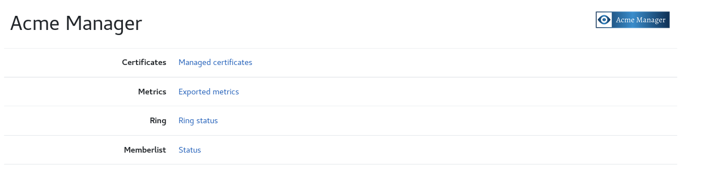
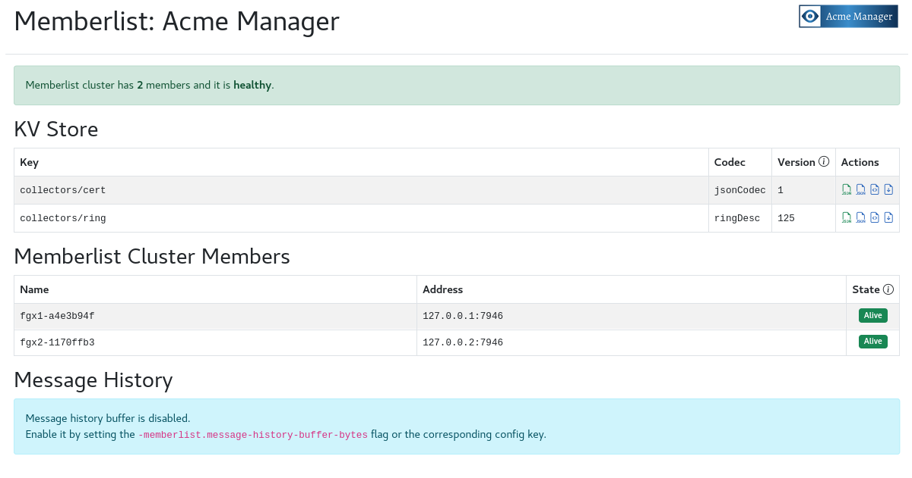

# acme_manager

Manages acme certificates and deploy them on servers.



## Overview

Acme Manager is an application which create certificate using [ACME](https://datatracker.ietf.org/doc/html/rfc8555), store them in vault  and deploy them on servers to be use by another application/proxy...

Acme Manager solves the certificate expiration issue with automatic renewal. It monitor the expiration date of each certificate and renew it before expiration (by default 30d before), update them in vault and deploy them on servers.

## How it works

Acme Manager run in cluster mode with the memberlist protocol.



One instance of the ring is elected to be the leader and this is the only one which will make request to acme servers, store certificate in vault and store non-sensitive data in the key value store of the ring.

If the leader instance goes down, another one will be elected and will start to manage certificates.

Peers are watching the kv store key for changes and deploy/remove local certificates.

### Usage

```
usage: acme_manager [<flags>]


Flags:
  -h, --[no-]help                Show context-sensitive help (also try --help-long and --help-man).
      --web.telemetry-path="/metrics"  
                                 Path under which to expose metrics.
      --web.prefix-path=""       Prefix path for all http requests.
      --[no-]web.systemd-socket  Use systemd socket activation listeners instead of port listeners
                                 (Linux only).
      --web.listen-address=:8989 ...  
                                 Addresses on which to expose metrics and web interface. Repeatable for
                                 multiple addresses.
      --web.config.file=""       [EXPERIMENTAL] Path to configuration file
                                 that can enable TLS or authentication. See:
                                 https://github.com/prometheus/exporter-toolkit/blob/master/docs/web-configuration.md
      --config-path="config.yml"  
                                 Config path
      --certificate-config-path="certificate.yml"  
                                 Certificate config path
      --ring.instance-id=RING.INSTANCE-ID  
                                 Instance ID to register in the ring.
      --ring.instance-addr=RING.INSTANCE-ADDR  
                                 IP address to advertise in the ring. Default is auto-detected.
      --ring.instance-port=7946  Port to advertise in the ring.
      --ring.instance-interface-names=RING.INSTANCE-INTERFACE-NAMES  
                                 List of network interface names to look up when finding the instance
                                 IP address.
      --ring.join-members=RING.JOIN-MEMBERS  
                                 Other cluster members to join.
      --check-renewal-interval=1h  
                                 Time interval to check if renewal needed
      --check-config-interval=30s  
                                 Time interval to check if config file changes
      --check-certificate-config-interval=30s  
                                 Time interval to check if certificate config file changes
      --check-local-certificate-interval=5m  
                                 Time interval to check if local certificate changes
      --log.level=info           Only log messages with the given severity or above. One of: [debug,
                                 info, warn, error]
      --log.format=logfmt        Output format of log messages. One of: [logfmt, json]
      --[no-]version             Show application version.
```

### Env File

Acme Manager load environment variables from .env file.
It's use to configure the dns challenge as lego library need it.

### Config file

Local certificate deployment are controlled by `certificate_deploy` in common block.

It is also possible to execute a custom command once certificate have been generated/revoked wih `cmd_enabled`.

Any valid acme issuers could be added in issuer block.

Private keys must exists for each given issuer in `rootpath_account`, here:
- /tmp/accounts/sectigo/private_key.pem
- /tmp/accounts/letsencrypt/private_key.pem

```
common:
  rootpath_account: /tmp/accounts
  rootpath_certificate: /tmp/certificates
  certificate_deploy: true
  certificate_dir: /etc/haproxy/ssl/vault/
  cmd_enabled: true
  cmd_run: /usr/bin/systemctl reload haproxy
  cmd_timeout: 30

issuer:
  sectigo:
    ca_dir_url: https://acme.sectigo.com/v2/OV
    eab: true
    kid: kid_value
    hmac: hmac_value
  letsencrypt:
    ca_dir_url: https://acme-staging-v02.api.letsencrypt.org/directory

storage:
  vault:
    role_id: "role_id_value"
    secret_id: "secret_id_value"
    url: " https://vault.example.com"
    secret_engine: "myengine"
    secret_prefix: "acme"
    mount_path: "login/approle"
```

Optional Common parameters:
- **cert_days** (int): Number of days before certificate expired (default: 90).
- **cert_days_renewal** (int): Number of days before certificate should be renewed (default: 30).
- **certificate_deploy** (bool): If set to true, deploy certificate and private key in given `certificate_dir`
- **certificate_dir** (string): Directory in which to deploy issuers certificates and private keys
- **cmd_enabled** (bool): If set to true, run a custom command after deploying certificates.
- **cmd_run** (string):  Command to run.
- **cmd_timeout** (int): Command timeout.
- **prune_certificate** (bool): If set to true, revoke certificate found in vault storage and not decalred in certificate file.

Optional Issuer parameters:
- **eab** (bool): Use External Account Binding for account registration. Requires `kid` and `hmac`.
- **kid** (string): Key identifier from External CA. Used for External Account Binding
- **hmac** (string): MAC key from External CA. Should be in Base64 URL Encoding without padding format. Used for External Account Binding.
- **http_challenge** (string): http challenge name to use for domain validation
- **dns_challenge** (string): dns challenge name to use for domain validation

### Certificate config file

Optional parameters:
- **bundle** (bool): if true, add the issuers certificate to the new certificate
- **renewal_days** (int): number of days before automatic certificate renewal
- **days** (int): number of days before certificate expiration
- **san** (string, comma separated): DNS domain names to add to certificate
- **http_challenge** (string): http challenge name to use for domain validation
- **dns_challenge** (string): dns challenge name to use for domain validation

```
certificate:
  - domain: testfgx01.example.com
    issuer: letsencrypt

  - domain: testfgx02.example.com
    issuer: sectigo
```

### DNS and HTTP Challenge

acme-manager support DNS and HTTP challenge (thanks to lego lib).

There is a custom HTTP Challenge based on kvring, that allow http domain validation with the embedded http endpoint in acme manager.

Setting the `http_challenge: kvring`, will store the challenge token in kvring and it could be retrieved with a call like:
```
curl http://testfgx01.example.com/.well-known/acme-challenge/NClsmGOVJqV9jx8xBLO6kabcxBufpLGcu5oUjjhhu1o
```

Once the domain is validated, the challenge token value is removed from kvring.


### Managed certificate web UI

The endpoint http://localhost:8989/certificate return the page for all managed certificate.


### Metrics Exposed

**App metrics**

This endpoint return metrics about app itself.

```
# HELP acme_manager_build_info A metric with a constant '1' value labeled by version, revision, branch, goversion from which acme_manager was built, and the goos and goarch for the build.
# TYPE acme_manager_build_info gauge
acme_manager_build_info{branch="",goarch="amd64",goos="linux",goversion="go1.22.5",revision="66881e952813a0b191d632ff2d63d74508c0e3c7-modified",tags="unknown",version=""} 1
```

### Limitations

Currently only vault storage with app role login is supported.

### TLS and basic authentication

Acme Manager supports TLS and basic authentication. This enables better control of the various HTTP endpoints.

To use TLS and/or basic authentication, you need to pass a configuration file using the `--web.config.file` parameter. The format of the file is described
[in the exporter-toolkit repository](https://github.com/prometheus/exporter-toolkit/blob/master/docs/web-configuration.md).

### Sources

- [Lego](https://github.com/go-acme/lego)
- [Hashicorp Memberlist](https://github.com/hashicorp/memberlist)
- [Grafana Distributed systems kit](https://github.com/grafana/dskit)
