# ACME Manager - Administrator Documentation

## Overview

This document provides comprehensive information for administrators deploying, configuring, and maintaining ACME Manager clusters.

## Table of Contents

- [Architecture](#architecture)
- [Cluster Design](#cluster-design)
- [Installation](#installation)
- [Configuration](#configuration)
- [High Availability](#high-availability)
- [API Architecture](#api-architecture)
- [Renewal Cycles](#renewal-cycles)
- [Plugin System](#plugin-system)
- [Security](#security)
- [Monitoring](#monitoring)
- [Maintenance](#maintenance)
- [Appendix](#appendix)

## Architecture

### System Overview

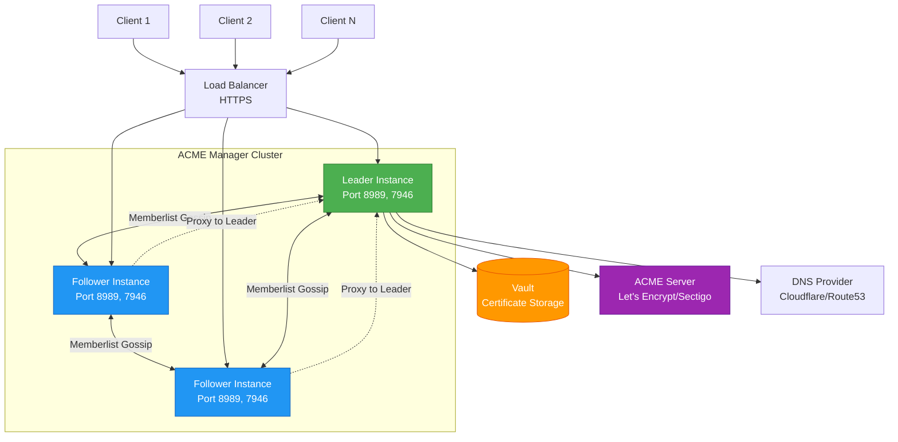

### Component Architecture

ACME Manager consists of several integrated layers:

**API Layer:**
- HTTP API endpoints (:8989/api)
- Web UI (:8989/ui)
- Prometheus metrics (:8989/metrics)
- Swagger documentation (:8989/swagger)

**Core Services:**
- Certificate Store (manages certificate lifecycle)
- Token Manager (authentication and authorization)
- Ring Manager (cluster coordination)

**Background Workers:**
- Renewal Worker (checks every 30 minutes)
- Token Expiry Worker (checks every 1 minute)
- Config Watcher (checks every 30 seconds)
- Issuer Health Checker (checks every 10 minutes)
- Cleanup Worker (optional, runs every 1 hour)

**Integration Layer:**
- Vault Client (secure storage)
- ACME Client (Lego v4.25.0)
- DNS Provider Clients
- Plugin Manager (custom providers)

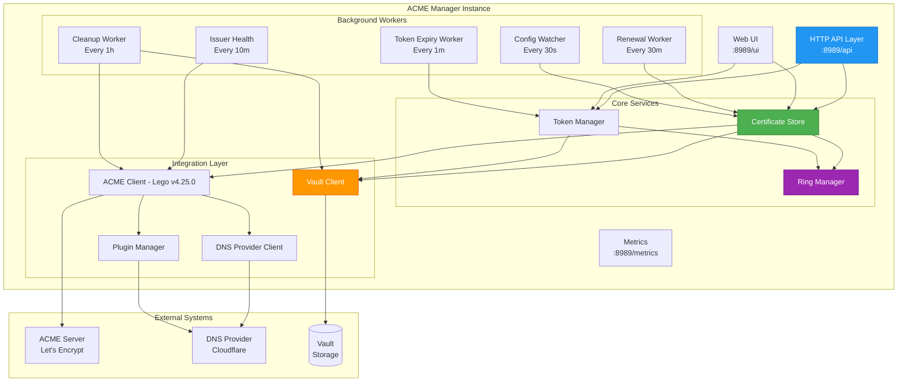

## Cluster Design

### Memberlist Protocol

ACME Manager uses HashiCorp's Memberlist for cluster coordination:

- **Gossip-based protocol**: Efficient, eventually consistent cluster state
- **Failure detection**: Automatic detection of unhealthy instances
- **Leader election**: Distributed consensus for single leader
- **KV store**: Shared key-value storage across cluster

### Leader Election

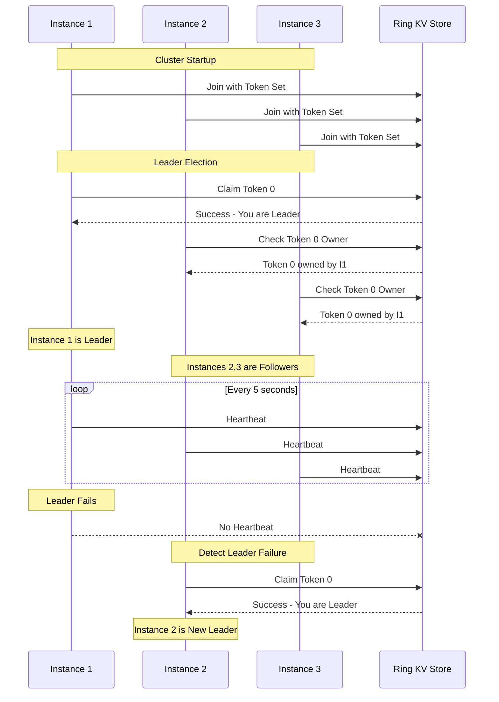

**Key Characteristics:**

- Only the leader performs ACME operations
- Leader election happens automatically on startup
- If leader fails, a new leader is elected within seconds
- Token 0 is reserved for leader identification
- Followers proxy requests to the leader

### Network Communication

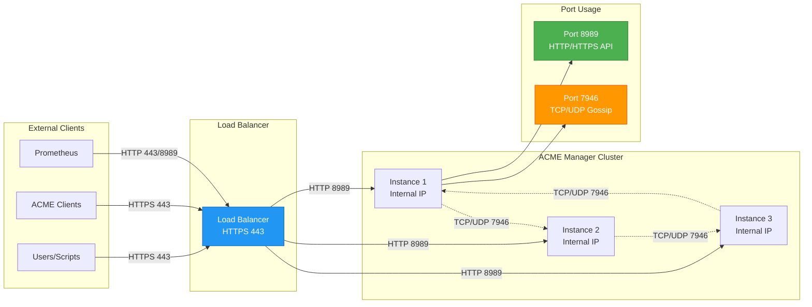

**Port 7946 (TCP/UDP):**
- Gossip protocol communication
- State synchronization
- Failure detection
- Metadata replication
- Leader announcements

**Port 8989 (HTTP/HTTPS):**
- API endpoints
- Web UI
- Metrics endpoint
- Inter-node proxying

## Installation

### Prerequisites

- Go 1.24+ (for building from source)
- HashiCorp Vault instance
- ACME-compatible CA (Let's Encrypt, Sectigo, etc.)
- DNS provider credentials (for DNS challenges)

### Building from Source

```bash
# Clone repository
git clone https://github.com/fgouteroux/acme_manager.git
cd acme_manager

# Build server
go build -o acme-manager-server ./cmd/acme-manager-server

# Build client
go build -o acme-manager-client ./cmd/acme-manager-client
```

### Deployment

#### Single Instance (Development)

```bash
./acme-manager-server \
  -config-path=config.yml \
  -log.level=info \
  -server.listen-address=:8989
```

#### Cluster Deployment (Production)

**Instance 1 (Bootstrap):**
```bash
./acme-manager-server \
  -config-path=config.yml \
  -ring.instance-id=node1 \
  -ring.instance-addr=192.168.1.10 \
  -ring.instance-port=7946 \
  -log.level=info
```

**Instance 2:**
```bash
./acme-manager-server \
  -config-path=config.yml \
  -ring.instance-id=node2 \
  -ring.instance-addr=192.168.1.11 \
  -ring.instance-port=7946 \
  -ring.join-members=192.168.1.10:7946 \
  -log.level=info
```

**Instance 3:**
```bash
./acme-manager-server \
  -config-path=config.yml \
  -ring.instance-id=node3 \
  -ring.instance-addr=192.168.1.12 \
  -ring.instance-port=7946 \
  -ring.join-members=192.168.1.10:7946,192.168.1.11:7946 \
  -log.level=info
```

### Systemd Service

Create `/etc/systemd/system/acme-manager.service`:

```ini
[Unit]
Description=ACME Manager Server
After=network.target vault.service

[Service]
Type=simple
User=acme-manager
Group=acme-manager
WorkingDirectory=/etc/acme-manager
ExecStart=/usr/bin/acme-manager-server \
  -config-path=/etc/acme-manager/config.yml \
  -env-config-path=/etc/acme-manager/.env \
  -ring.instance-id=%H \
  -ring.join-members=node1:7946,node2:7946,node3:7946
Restart=on-failure
RestartSec=5s

[Install]
WantedBy=multi-user.target
```

Enable and start:
```bash
systemctl daemon-reload
systemctl enable acme-manager
systemctl start acme-manager
systemctl status acme-manager
```

## Configuration

### Server Configuration

**config.yml:**
```yaml
common:
  # API key hash for token management (SHA256 hash)
  api_key_hash: "e3b0c44298fc1c149afbf4c8996fb92427ae41e4649b934ca495991b7852b855"
  
  # Account and certificate storage paths
  rootpath_account: /var/lib/acme-manager/accounts
  rootpath_certificate: /var/lib/acme-manager/certificates
  
  # HTTP client retry configuration
  http_client_retry_max: 3
  http_client_retry_wait_min: 1
  http_client_retry_wait_max: 10
  http_client_retry_status_code: [429, 500, 502, 503, 504]
  
  # Plugin configuration (optional)
  plugins:
    - name: acme-manager-custom-plugin
      path: /usr/bin/acme-manager-custom-plugin
      checksum: "abc123def456..."
      timeout: 30
      env:
        MY_VAR_KEY: "your-var-key"

# ACME issuers configuration
issuer:
  # Let's Encrypt production
  letsencrypt:
    ca_dir_url: https://acme-v02.api.letsencrypt.org/directory
    eab: false
    certificate_timeout: 300
    overall_request_limit: 20
  
  # Let's Encrypt staging
  letsencrypt-staging:
    ca_dir_url: https://acme-staging-v02.api.letsencrypt.org/directory
    eab: false
    certificate_timeout: 300
  
  # Sectigo with External Account Binding
  sectigo:
    ca_dir_url: https://acme.sectigo.com/v2/OV
    eab: true
    kid: "your-kid-value"
    hmac: "your-hmac-value"
    certificate_timeout: 600
    overall_request_limit: 10

# Storage backend configuration
storage:
  vault:
    role_id: "your-vault-role-id"
    secret_id: "your-vault-secret-id"
    url: "https://vault.example.com"
    secret_engine: "secret"
    certificate_prefix: "certificates"
    token_prefix: "tokens"
    mount_path: "approle"
    retry_max: 3
    retry_wait_min: 1
    retry_wait_max: 10
```

### Environment Variables

**.env:**
```bash
# DNS provider credentials (example: Cloudflare)
CLOUDFLARE_EMAIL=admin@example.com
CLOUDFLARE_API_KEY=your-cloudflare-api-key

# DNS challenge settings
ACME_MANAGER_DNS_RESOLVERS=8.8.8.8:53,1.1.1.1:53
ACME_MANAGER_DNS_TIMEOUT=10
ACME_MANAGER_DNS_PROPAGATIONWAIT=120

# Route53 (AWS)
AWS_ACCESS_KEY_ID=your-access-key
AWS_SECRET_ACCESS_KEY=your-secret-key
AWS_REGION=us-east-1

# Google Cloud DNS
GCE_PROJECT=your-project-id
GCE_SERVICE_ACCOUNT_FILE=/path/to/credentials.json

# Azure DNS
AZURE_CLIENT_ID=your-client-id
AZURE_CLIENT_SECRET=your-client-secret
AZURE_SUBSCRIPTION_ID=your-subscription-id
AZURE_TENANT_ID=your-tenant-id
AZURE_RESOURCE_GROUP=your-resource-group
```

### Command-Line Flags

```bash
# Logging
-log.level string          # Log level: debug, info, warn, error (default "info")
-log.format string         # Log format: logfmt, json (default "logfmt")

# Server
-server.listen-address string        # Listen address (default ":8989")
-server.tls-cert-file string        # TLS certificate file
-server.tls-key-file string         # TLS key file
-server.tls-client-ca-file string   # Client CA certificate
-server.http-read-timeout int       # Read timeout in seconds (default 300)
-server.http-read-header-timeout int # Header read timeout (default 10)

# Configuration
-config-path string        # Config file path (default "config.yml")
-env-config-path string   # Environment file path (default ".env")

# Check intervals
-check-renewal-interval duration    # Certificate renewal check (default 30m)
-check-config-interval duration     # Config file check (default 30s)
-check-token-interval duration      # Token expiration check (default 1m)
-check-issuer-interval duration     # Issuer health check (default 10m)

# Cluster (Ring)
-ring.instance-id string           # Unique instance ID
-ring.instance-addr string         # Instance IP address
-ring.instance-port int            # Instance port (default 7946)
-ring.join-members string          # Comma-separated list of cluster members
-ring.heartbeat-period duration    # Heartbeat interval (default 5s)
-ring.heartbeat-timeout duration   # Heartbeat timeout (default 1m)

# Cleanup (optional)
-cleanup                                    # Enable cleanup
-cleanup.interval duration                  # Cleanup scan interval (default 1h)
-cleanup.cert-expire-days int              # Days before expiry to cleanup (default 10)
-cleanup.cert-revoke-last-version          # Revoke last version on cleanup
```

## High Availability

### Cluster Best Practices

1. **Odd Number of Nodes**: Deploy 3, 5, or 7 nodes for reliable quorum
2. **Geographic Distribution**: Spread nodes across availability zones
3. **Load Balancing**: Use a load balancer in front of API endpoints
4. **Health Checks**: Monitor `/metrics` endpoint for cluster health

### Failure Scenarios

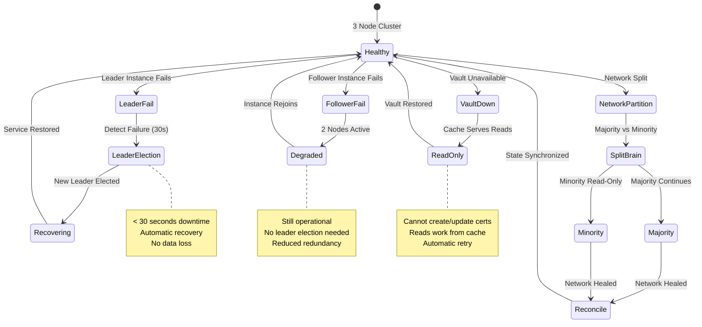

#### Leader Failure

**Impact:**
- Brief service interruption (< 30 seconds)
- No data loss (memberlist kv store)
- Automatic recovery

**Recovery Process:**
1. Followers detect leader failure (no heartbeat)
2. New leader election initiated
3. New leader elected within seconds
4. Service resumes normal operation

#### Network Partition

**Majority Partition:**
- Maintains quorum and continues operations
- Elects new leader if needed
- Processes all requests normally

**Minority Partition:**
- Cannot maintain quorum
- Becomes read-only
- Rejoins when partition heals

#### Vault Failure

**Impact:**
- Cannot create/read/update/delete certificates
- Read certificate metadata work from memberlist kv store
- Automatic retry with exponential backoff

**Recovery:**
- Service automatically recovers when Vault returns
- No manual intervention needed
- State remains consistent

## API Architecture

### Request Flow

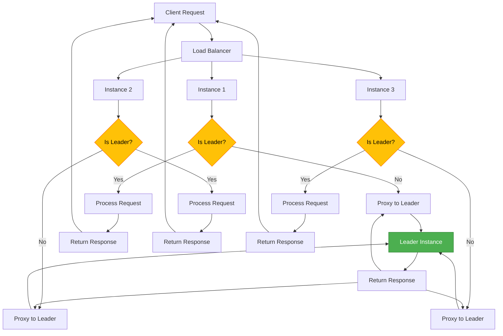

The API follows a leader-based architecture where all write operations are performed by the leader instance. Follower instances automatically proxy requests to the current leader.

**Request Processing:**
1. Client sends request to any instance (via load balancer)
2. Instance checks if it's the leader
3. If leader: Process request directly
4. If follower: Proxy to leader and return response
5. Leader performs operation (ACME, Vault, Ring KV updates)
6. Response returned to client

**Authentication Flow:**
- Admin operations: X-API-Key header (SHA256 hash verification)
- User operations: Bearer token (stored in Ring KV + Vault)
- Token scopes: read, create, update, delete

### Certificate Creation Flow

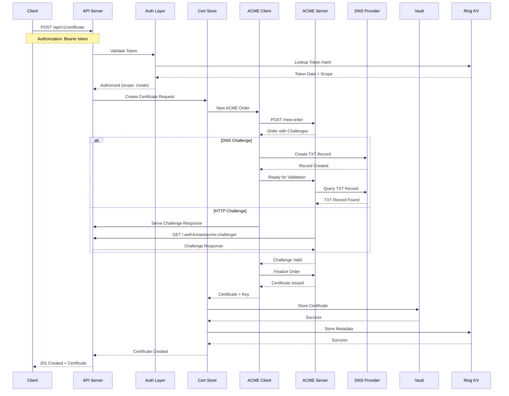

## Renewal Cycles

### Certificate Lifecycle

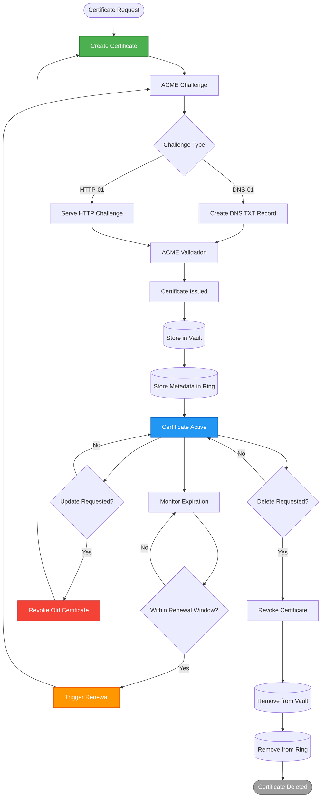

**Lifecycle Stages:**

1. **Day 0**: Certificate Created
   - Generate CSR
   - Submit to ACME server
   - Complete challenge (DNS/HTTP)
   - Receive certificate
   - Store in Vault + Ring KV

2. **Days 1-59**: Normal Operation
   - Certificate served
   - Periodic health checks
   - No action needed

3. **Days 60-70**: Renewal Window (renewal_days: "20-30")
   - Leader checks expiration every 30 minutes
   - Random day selected in range
   - Renewal process initiated
   - New certificate stored
   - Old certificate remains valid

4. **Day 71-90**: Grace Period
   - New certificate deployed
   - Old certificate still valid
   - Cleanup scheduled

5. **Day 90+**: Expiration
   - Old certificate expires
   - Cleanup removes old version (if enabled)

### Renewal Process

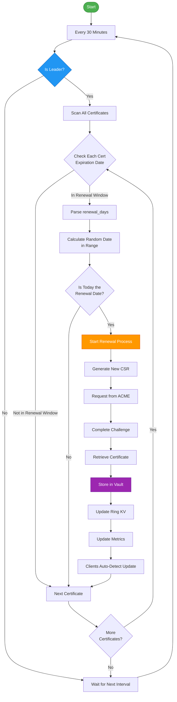

### Background Workers

**Leader Only:**
- Certificate Renewal Checker (every 30m)
- Cleanup Worker (every 1h, optional)

**All Instances:**
- Token Expiration Checker (every 1m)
- Config File Watcher (every 30s)
- Issuer Health Checker (every 10m)
- Ring KV Store Watcher (continuous)

## Plugin System

### Overview

ACME Manager supports a plugin system for extending DNS provider support beyond the built-in Lego providers.

### Plugin Architecture

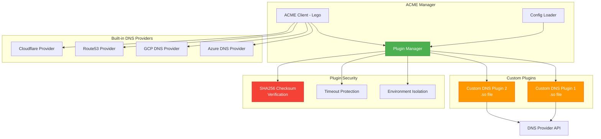

### Plugin Configuration

```yaml
common:
  plugins:
    - name: acme-manager-custom-plugin
      path: /usr/bin/acme-manager-custom-plugin
      checksum: "abc123def456789..."
      timeout: 30
      env:
        MY_VAR_KEY: "your-var-key"
```

### Plugin Parameters

| Parameter | Type | Required | Description |
|-----------|------|----------|-------------|
| `name` | string | Yes | Unique plugin identifier |
| `path` | string | Yes | Absolute path to plugin .so file |
| `checksum` | string | Yes | SHA256 checksum for verification |
| `timeout` | int | No | Execution timeout in seconds (default: 30) |
| `env` | map | No | Environment variables for the plugin |


### Building Plugins

```bash
# Build plugin
go build -o acme-manager-custom-plugin main.go

# Calculate checksum
sha256sum acme-manager-custom-plugin
# Output: abc123def456789... acme-manager-custom-plugin
```

### Plugin Security

**Security Measures:**

1. **Checksum Verification**: SHA256 checksums prevent tampering
2. **Isolated Execution**: Plugins run with controlled access
3. **Timeout Protection**: Configurable timeouts prevent hangs
4. **Environment Isolation**: Plugin-specific environment variables

## Security

### Vault Integration

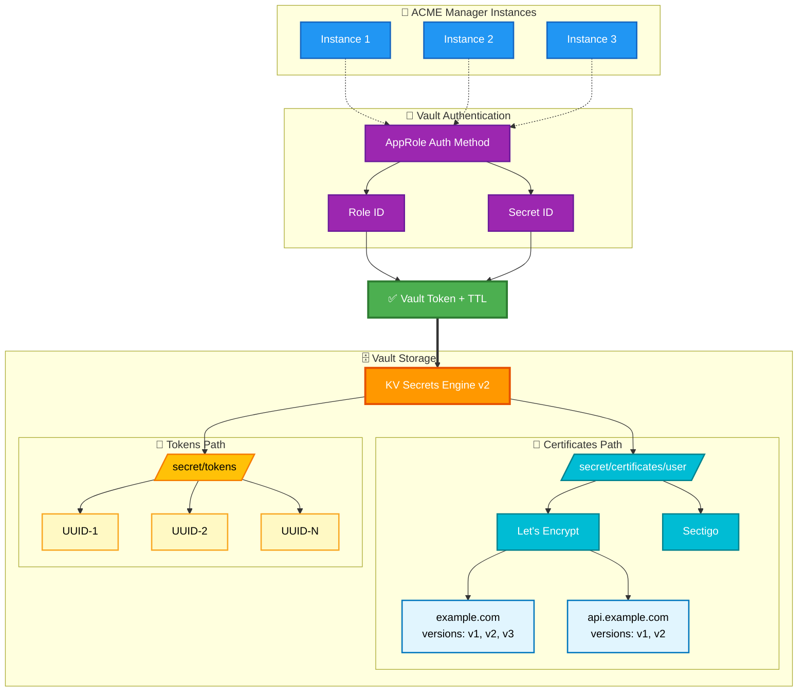

**AppRole Authentication:**

The system uses HashiCorp Vault's AppRole authentication method for secure access to secrets.

**Authentication Process:**
1. ACME Manager starts with RoleID and SecretID
2. Authenticates to Vault using AppRole
3. Receives time-limited token (typically 1 hour TTL)
4. Token cached and automatically renewed before expiration
5. All Vault operations use the current valid token

### Token Authentication

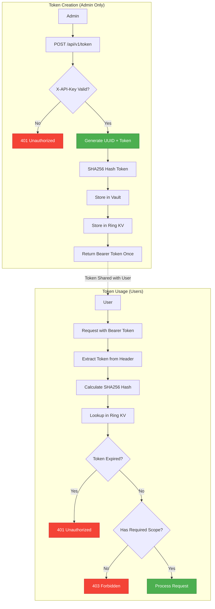

### API Security

**Token Scopes:**

| Scope | Permissions |
|-------|------------|
| `read` | GET certificates, GET token info |
| `create` | POST certificates |
| `update` | PUT certificates |
| `delete` | DELETE certificates, REVOKE certificates |

**Security Best Practices:**

1. **Token Management:**
   - Use minimal required scopes
   - Set appropriate expiration times (30-90 days)
   - Rotate tokens regularly
   - Use SHA256 hashing
   - Store tokens securely

2. **TLS Configuration:**
   ```bash
   # Generate cert for production
   openssl req -x509 -newkey rsa:4096 -nodes \
     -keyout server.key -out server.crt \
     -days 365 -subj "/CN=acme-manager.example.com"
   
   # Run with TLS
   ./acme-manager-server \
     -server.tls-cert-file=server.crt \
     -server.tls-key-file=server.key \
     -server.tls-client-ca-file=ca.crt
   ```

3. **Vault Security:**
   - Use dedicated AppRole for ACME Manager
   - Apply least-privilege policies
   - Enable audit logging
   - Rotate SecretID regularly

**Example Vault Policy:**
```hcl
path "secret/data/certificates/*" {
  capabilities = ["create", "read", "update", "delete", "list"]
}

path "secret/data/tokens/*" {
  capabilities = ["create", "read", "update", "delete", "list"]
}
```

## Monitoring

### Prometheus Metrics

**Application Metrics:**

```prometheus
# Certificate operations
acme_manager_certificate_total
acme_manager_certificate_created
acme_manager_certificate_revoke
acme_manager_certificate_renewed

# Local Certificate operations
acme_manager_local_certificate_created_total
acme_manager_local_certificate_deleted_total

# Local command pre/post run
acme_manager_local_cmd_run_success_total
acme_manager_local_cmd_run_failed_total

# Vault operations
acme_manager_vault_get_secret_success_total
acme_manager_vault_put_secret_success_total
acme_manager_vault_delete_secret_success_total
acme_manager_vault_get_secret_failed_total
acme_manager_vault_put_secret_failed_total
acme_manager_vault_delete_secret_failed_total

# Config file
acme_manager_config_reload
acme_manager_config_error

# Issuer health
acme_manager_issuer_config_error{issuer}

# System metrics
acme_manager_build_info{version, revision, branch, goversion}
```

**Ring/Cluster Metrics:**

```prometheus
# Memberlist
acme_manager_memberlist_client_cas_attempt_total
acme_manager_memberlist_client_cas_failure_total
acme_manager_memberlist_client_cas_success_total
acme_manager_memberlist_client_cluster_members_count
acme_manager_memberlist_client_cluster_node_health_score
acme_manager_memberlist_client_kv_store_count
acme_manager_memberlist_client_kv_store_value_tombstones
acme_manager_memberlist_client_kv_store_value_tombstones_removed_total
acme_manager_memberlist_client_messages_in_broadcast_queue
acme_manager_memberlist_client_messages_in_broadcast_queue_bytes
acme_manager_memberlist_client_messages_to_broadcast_dropped_total
acme_manager_memberlist_client_pending_key_notifications
acme_manager_memberlist_client_received_broadcasts_bytes_total
acme_manager_memberlist_client_received_broadcasts_dropped_total
acme_manager_memberlist_client_received_broadcasts_invalid_total
acme_manager_memberlist_client_received_broadcasts_total
acme_manager_memberlist_client_state_pulls_bytes_total
acme_manager_memberlist_client_state_pulls_total
acme_manager_memberlist_client_state_pushes_bytes_total

# Ring operations
acme_manager_ring_member_heartbeats_total
acme_manager_ring_member_tokens_owned
acme_manager_ring_member_tokens_to_own
acme_manager_ring_members
acme_manager_ring_oldest_member_timestamp
acme_manager_ring_tokens_total
```

### Grafana Dashboard

**Example PromQL Queries:**

```promql
# Certificate creation rate
rate(acme_manager_certificate_created[5m])

# Certificates by issuer
sum by (issuer) (acme_manager_certificate_total)

# Cluster members
count(up{job="acme-manager"})

# Get Leader node
acme_manager_node_role == 1

# Get Follower nodes
acme_manager_node_role == 2

# Certificate expiration alerts
acme_manager_certificate_expiry < 30
```

### Alerting Rules


```yaml
groups:
  - name: acme_manager
    interval: 30s
    rules:
      # Certificate expiring soon
      - alert: CertificateExpiringSoon
        expr: acme_manager_certificate_expiry < 7
        for: 1h
        labels:
          severity: warning
        annotations:
          summary: "Certificate {{ $labels.domain }} expires in < 7 days"
          description: "Certificate for {{ $labels.domain }} from {{ $labels.issuer }} will expire in less than 7 days"
      
      # No cluster leader
      - alert: NoClusterLeader
        expr: count(acme_manager_node_role == 1) == 0
        for: 5m
        labels:
          severity: critical
        annotations:
          summary: "ACME Manager cluster has no leader"
          description: "The ACME Manager cluster has no active leader. Certificate operations are blocked."
      
      # Issuer health check failing
      - alert: IssuerUnhealthy
        expr: acme_manager_issuer_config_error > 0
        for: 10m
        labels:
          severity: warning
        annotations:
          summary: "Issuer {{ $labels.issuer }} health check failing"
          description: "The ACME issuer {{ $labels.issuer }} has been unhealthy for 10 minutes"
      
      # Instance down
      - alert: ACMEManagerDown
        expr: up{job="acme-manager"} == 0
        for: 5m
        labels:
          severity: critical
        annotations:
          summary: "ACME Manager instance {{ $labels.instance }} is down"
          description: "Instance {{ $labels.instance }} has been down for 5 minutes"
```


## Maintenance

### Backup Procedures

```bash
#!/bin/bash
# Backup all certificates
BACKUP_DIR="backup/$(date +%Y%m%d_%H%M%S)"
mkdir -p "$BACKUP_DIR/certificates"

vault kv list -format=json secret/certificates/ | \
  jq -r '.[]' | \
  while read path; do
    vault kv get -format=json "secret/certificates/$path" > \
      "$BACKUP_DIR/certificates/${path//\//_}.json"
  done
```

### Deployment Topology

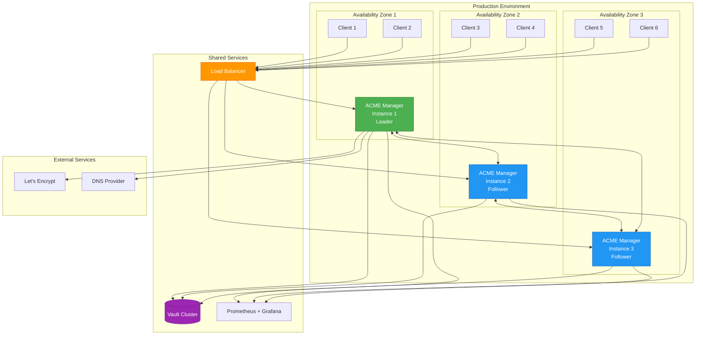

## Appendix

### Supported DNS Providers (100+)

- Cloudflare, Route53, Google Cloud DNS, Azure DNS
- OVH, GoDaddy, Gandi, DigitalOcean, Linode
- And many more via Lego library

### API Endpoint Summary

| Method | Endpoint | Auth | Description |
|--------|----------|------|-------------|
| GET | `/api/v1/certificate/{issuer}/{domain}` | Bearer | Get certificate |
| POST | `/api/v1/certificate` | Bearer | Create certificate |
| PUT | `/api/v1/certificate` | Bearer | Update certificate |
| DELETE | `/api/v1/certificate/{issuer}/{domain}` | Bearer | Delete certificate |
| GET | `/metrics` | None | Prometheus metrics |
| GET | `/swagger` | None | API documentation |

---

**Version:** 0.6.1+  
**Last Updated:** October 2025  
**Go Version:** 1.24+